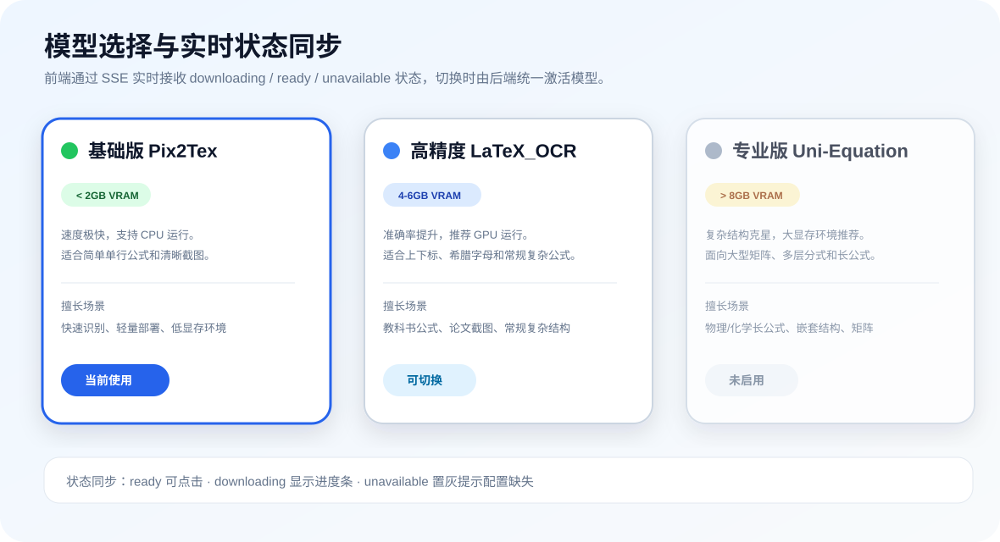
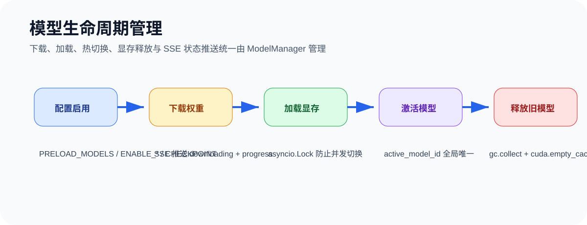

# LocalMathOCR

<div align="center">

**完全本地运行的数学公式 OCR Web 应用**

前端使用 **React + TypeScript + Vite**，后端使用 **FastAPI + pix2tex**，在本机 CPU / GPU 上完成公式图片到 LaTeX 的识别、编辑、预览与导出。

[](https://www.python.org/)
[](https://fastapi.tiangolo.com/)
[](https://react.dev/)
[](https://www.typescriptlang.org/)
[](https://vitejs.dev/)
[](LICENSE)

</div>

---

## 项目预览

### 主界面


### 导出与字体选择


### 模型选择与状态同步



### 模型生命周期管理



---

## 核心特性

- **全本地识别**：不依赖外部付费 OCR API，公式识别在本机完成
- **多模型动态切换**：支持 Pix2Tex、LaTeX_OCR、Uni-Equation 的启用、下载、热切换与状态同步
- **CPU / GPU 自动适配**：支持自动检测 CUDA，也可手动切换运行模式
- **图片预处理**：灰度化、二值化、去白边、放大、倾斜校正，提升识别稳定性
- **拖拽 / 上传 / 剪贴板粘贴**：支持 JPG、PNG、WebP 直接识别
- **手动框选裁剪**：上传后进入裁剪模式，可拖拽选区精确框选公式区域，减少无关内容干扰
- **识别置信度提示**：OCR 返回置信度评分，低于阈值时自动弹出警告，提示人工核对
- **LaTeX 编辑与实时预览**：CodeMirror 编辑源码，KaTeX 实时渲染结果
- **导出能力**：支持 PNG / SVG 导出，默认 Times New Roman，并可切换 Cambria Math、STIX、Latin Modern 等字体
- **历史记录**：本地 SQLite 持久化，支持回显、删除和清空
- **双端开发体验**：后端 FastAPI + 前端 Vite，结构清晰，便于二次开发

---

## 页面功能说明

| 模块 | 说明 |
| --- | --- |
| 上传识别 | 拖拽、上传、粘贴图片，一键识别公式 |
| 手动框选 | 上传后进入裁剪模式，可拖拽选区框选纯公式区域，确认后裁剪发送识别 |
| 置信度提示 | 识别置信度低于 80% 时显示警告条，提示人工核对 |
| 预处理开关 | 对输入图像做轻度预处理，适合截图和拍照图 |
| LaTeX 编辑器 | 可直接修改识别结果，适合快速修正公式 |
| 实时预览 | 右侧预览区域即时展示最终渲染效果 |
| 导出 | 可导出 PNG / SVG，并选择导出字体 |
| 历史记录 | 查看历史识别记录，支持删除与清空 |
| 模型选择 | 展示 Pix2Tex、LaTeX_OCR、Uni-Equation 的状态、显存需求、特点与切换按钮 |
| 模型状态 | 通过 SSE 实时显示 downloading / ready / unavailable 和下载进度 |

---

## 技术栈

### 前端

- React 18
- TypeScript
- Vite
- Tailwind CSS
- Zustand
- CodeMirror
- KaTeX
- react-image-crop
- html2canvas

### 后端

- FastAPI
- Uvicorn
- pix2tex
- PyTorch
- Transformers / Hugging Face Hub（可选，用于 Uni-Equation 等大模型）
- OpenCV
- Pillow
- SQLite + aiosqlite

---

## 快速开始

### 1. 环境要求

#### CPU 模式

- Python 3.10+
- 建议 4 核 CPU、8GB 内存以上
- 首次模型加载可能需要数十秒

#### GPU 模式

- NVIDIA GPU，建议 6GB 显存以上
- 已安装 NVIDIA Driver
- 可访问 CUDA / NVIDIA Container Toolkit

---

### 2. Windows 一键启动

双击根目录脚本：

```text
start.bat
```

启动后可选择：

```text
[1] CPU 模式：兼容性最好，速度较慢
[2] GPU 模式：需要 NVIDIA GPU / CUDA 环境，速度更快
```

脚本会自动完成：

- 检查 Python、npm、端口占用
- 创建后端虚拟环境 `backend/.venv`
- 安装/检查后端依赖
- 安装/检查前端依赖
- 启动后端与前端窗口
- 自动打开浏览器访问前端页面

> 首次运行 pix2tex 时可能需要下载或加载模型，请等待页面右上角状态变为 **ready**。

### 3. 停止服务

双击根目录脚本：

```text
stop.bat
```

它会停止前端、后端以及启动器残留进程，并清理端口占用。

---

## Docker 启动

### CPU

```bash
docker compose --profile cpu up --build
```

### GPU

```bash
docker compose --profile gpu up --build
```

访问地址：

- 前端：`http://localhost:8080`
- 后端健康检查：`http://localhost:8000/health`
- 模型状态：`http://localhost:8000/api/model-status`

---

## 本地开发

### 后端

```bash
cd backend
python -m venv .venv
source .venv/bin/activate  # Windows: .venv\Scripts\activate
pip install -r requirements.txt
uvicorn app.main:app --reload --host 0.0.0.0 --port 8000
```

### 前端

```bash
cd frontend
npm install
npm run dev
```

开发环境下默认通过 Vite 代理访问后端，避免跨域问题。

---

## 环境变量

### 后端

| 变量 | 默认值 | 说明 |
| --- | --- | --- |
| `APP_DEVICE` | `auto` | `auto` / `cpu` / `cuda` |
| `DATABASE_URL` | `sqlite+aiosqlite:///./data/history.db` | SQLite 数据库地址 |
| `MODEL_DIR` | `./models` | 模型缓存目录 |
| `CORS_ORIGINS` | `http://localhost:5173,http://127.0.0.1:5173,http://localhost:8080,http://127.0.0.1:8080` | 允许跨域来源 |
| `RETURN_PREPROCESSED_IMAGE` | `true` | 是否返回预处理图片预览 |
| `DEFAULT_MODEL_ID` | `pix2tex` | 默认模型 ID |
| `ENABLE_PIX2TEX` | `true` | 是否启用基础版 Pix2Tex |
| `ENABLE_LATEX_OCR` | `true` | 是否启用高精度版 LaTeX_OCR |
| `ENABLE_UNI_EQUATION` | `false` | 是否启用专业版 Uni-Equation，大显存环境建议手动开启 |
| `LATEX_OCR_CHECKPOINT` | 空 | 高精度版权重路径；不配置时高精度版会显示为未配置，不再复用 pix2tex 权重 |
| `UNI_EQUATION_MODEL_NAME` | 空 | Uni-Equation Hugging Face 模型名 |
| `UNI_EQUATION_CHECKPOINT` | 空 | Uni-Equation 本地权重/模型目录，优先级高于模型名 |
| `MAX_LOADED_MODELS` | `1` | 同时保留在显存/内存中的模型数量，超过后自动卸载旧模型 |
| `PRELOAD_MODELS` | `pix2tex` | 启动时检查/下载的模型列表，逗号分隔，如 `pix2tex,latex_ocr` |
| `PIX2TEX_WEIGHTS_URL` | pix2tex release 地址 | pix2tex 权重自动下载地址 |
| `LATEX_OCR_REPO_ID` | 空 | 高精度版 Hugging Face 仓库 ID，用于自动下载 |
| `UNI_EQUATION_REPO_ID` | 空 | Uni-Equation Hugging Face 仓库 ID，用于自动下载 |
| `MODEL_DOWNLOAD_TIMEOUT_SEC` | `1800` | 模型下载超时参考配置 |

### 如何真正启用 LaTeX_OCR

`LaTeX_OCR` 必须配置独立权重才会启用；如果未配置，前端会显示“未配置独立权重”，不会复用 pix2tex 权重，避免误以为模型已切换。

#### 方式一：使用本地权重

将高精度版权重放到本地，例如：

```text
backend/models/latex_ocr/weights.pth
```

然后在后端 `.env` 中配置：

```env
ENABLE_LATEX_OCR=true
LATEX_OCR_CHECKPOINT=./models/latex_ocr/weights.pth
PRELOAD_MODELS=pix2tex,latex_ocr
```

#### 方式二：使用 Hugging Face 仓库

如果你有可用的 LaTeX_OCR 权重仓库，配置：

```env
ENABLE_LATEX_OCR=true
LATEX_OCR_REPO_ID=your-org/your-latex-ocr-model
PRELOAD_MODELS=pix2tex,latex_ocr
```

> 当前加载器默认在仓库或目录中查找 `weights.pth`。如果你的仓库文件名不同，请改为使用 `LATEX_OCR_CHECKPOINT` 指向实际文件。

#### 验证 LaTeX_OCR 是否真的生效

1. 启动后访问：

```text
http://127.0.0.1:8000/api/models
```

确认 `latex_ocr` 是：

```json
{
  "id": "latex_ocr",
  "status": "ready",
  "active": false
}
```

如果看到：

```json
{
  "id": "latex_ocr",
  "status": "unavailable",
  "message": "未配置独立权重"
}
```

说明高精度版还没有配置成功。

2. 在前端点击 LaTeX_OCR 后，再识别一张图片，接口返回中应包含：

```json
{
  "model_id": "latex_ocr"
}
```

如果返回的是：

```json
{
  "model_id": "pix2tex"
}
```

说明实际推理仍然走的是基础版。

3. 也可以直接调用切换接口验证：

```bash
curl -X POST http://127.0.0.1:8000/api/models/latex_ocr/activate
```

成功后再次访问 `/api/models`，应看到：

```json
{
  "active_model_id": "latex_ocr"
}
```

### 如何启用专业版 Uni-Equation

`Uni-Equation` 面向多层嵌套分数、大型矩阵、物理/化学长公式等复杂场景，显存建议 `>8GB`。默认关闭，避免普通 CPU/低显存设备启动时误下载大模型或 OOM。

#### 方式一：使用 Hugging Face 仓库

在后端 `.env` 中配置：

```env
ENABLE_UNI_EQUATION=true
UNI_EQUATION_REPO_ID=your-org/your-uni-equation-model
PRELOAD_MODELS=pix2tex,uni_equation
```

如果仓库名就是可直接加载的模型名，也可以使用：

```env
ENABLE_UNI_EQUATION=true
UNI_EQUATION_MODEL_NAME=your-org/your-uni-equation-model
PRELOAD_MODELS=pix2tex,uni_equation
```

#### 方式二：使用本地模型目录

将模型文件放到本地目录，例如：

```text
backend/models/uni_equation/
```

然后配置：

```env
ENABLE_UNI_EQUATION=true
UNI_EQUATION_CHECKPOINT=./models/uni_equation
PRELOAD_MODELS=pix2tex,uni_equation
```

#### 验证 Uni-Equation 是否生效

启动后访问：

```text
http://127.0.0.1:8000/api/models
```

确认 `uni_equation` 是：

```json
{
  "id": "uni_equation",
  "status": "ready"
}
```

前端点击专业版后，识别接口返回中应包含：

```json
{
  "model_id": "uni_equation"
}
```

如果看到 `unavailable`，请检查是否配置了以下任意一项：

```env
UNI_EQUATION_REPO_ID=...
UNI_EQUATION_MODEL_NAME=...
UNI_EQUATION_CHECKPOINT=...
```

### 字体与导出说明

预览和导出默认使用 `Times New Roman`。由于 KaTeX 自带数学字体样式，项目已对预览区和导出容器增加字体覆盖规则，确保选择 Times New Roman、Cambria Math、STIX Two Math 等选项时，公式主体也会跟随切换。

如果你的系统没有安装某个字体，浏览器会自动回退到字体栈中的下一个字体。建议 Windows 用户使用 `Times New Roman` 或 `Cambria Math`，科研排版可安装 `STIX Two Math` 或 `Latin Modern Math`。

### 前端

| 变量 | 默认值 | 说明 |
| --- | --- | --- |
| `VITE_API_BASE_URL` | `/api` | 后端 API 地址 |

---

## API 概览

统一响应格式：

```json
{ "code": 200, "message": "success", "data": {} }
```

### 主要接口

- `GET /api/models`
- `GET /api/models/events`（SSE 模型状态流）
- `POST /api/models/{model_id}/activate`
- `GET /api/model-status`
- `POST /api/ocr`  
  表单字段：`file`、`preprocess`、`model_id`
- `POST /api/recognize`（兼容旧接口）  
  表单字段：`file`、`preprocess`、`model_id`
- `GET /api/history`
- `POST /api/history`
- `DELETE /api/history`
- `DELETE /api/history/{id}`

---

## 目录结构

```text
LocalMathOCR/
├─ backend/
│  ├─ app/
│  ├─ models/
│  ├─ data/
│  └─ requirements.txt
├─ frontend/
│  ├─ src/
│  ├─ index.html
│  └─ package.json
├─ docs/
│  ├─ preview-main.svg
│  ├─ preview-export.svg
│  ├─ preview-model-selector.svg
│  └─ model-lifecycle.svg
├─ start.bat
├─ stop.bat
└─ README.md
```

---

## 注意事项

- 本项目不调用外部识别 API；首次运行可能下载开源模型权重。
- 建议在可信网络环境下提前缓存模型到 `MODEL_DIR`。
- 识别准确率与图片清晰度关系较大，建议使用白底黑字、边缘完整、分辨率足够的截图。
- 若后端未就绪，前端会提示无法连接，请先确认 `http://127.0.0.1:8000/health` 是否可访问。

---

## 许可

本项目采用 MIT License。
