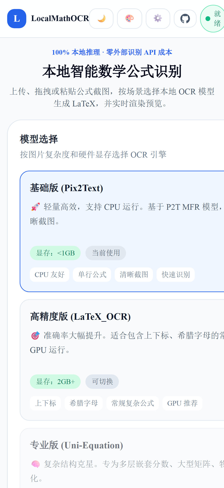

# LocalMathOCR

<div align="center">

**完全本地运行的数学公式 OCR Web 应用**

前端使用 **React + TypeScript + Vite**，后端使用 **FastAPI + Pix2Text**，在本机 CPU / GPU 上完成公式图片到 LaTeX 的识别、编辑、预览与导出。

[](https://www.python.org/)
[](https://fastapi.tiangolo.com/)
[](https://react.dev/)
[](https://www.typescriptlang.org/)
[](https://vitejs.dev/)
[](LICENSE)

</div>

---

## 项目预览

### 主界面（桌面端）


### 移动端适配



### 设置面板


### 架构设计

| 模型选择与状态同步 | 模型生命周期管理 |
| :---: | :---: |
|  |  |

---

## 核心特性

- **全本地识别** — 不依赖外部付费 OCR API，公式识别在本机完成
- **多模型动态切换** — Pix2Text、LaTeX_OCR、Uni-Equation 三种引擎，支持下载、热切换与状态同步
- **CPU / GPU 自动适配** — 自动检测 CUDA，也可手动切换运行模式
- **手动框选裁剪** — 上传后进入裁剪模式，移动端支持放大镜辅助框选
- **识别置信度提示** — OCR 返回置信度评分，低于阈值自动弹出警告
- **主题定制** — 8 种预设配色方案，卡片式 / 下拉菜单式两种模型选择器风格
- **设置面板** — 可视化配置默认模型、预处理、模型开关等参数，保存后即时生效无需重启
- **高级图片预处理** — 深色背景反转、自适应二值化、去噪、倾斜校正、自动裁剪，可通过设置面板开关
- **公式工作区** — MathLive 可视化编辑 + CodeMirror 源码编辑，公式模板快捷栏，13 种格式统一导出
- **LaTeX 语法验证** — 源码模式错误位置红色波浪线高亮，显示行号列号和具体原因，一键修复常见错误
- **数学计算工作台** — SymPy 符号计算，支持展开、因式分解、化简、求解、求导、积分、极限、级数
- **PDF 公式提取** — 上传 PDF，按页查看，在页面上框选公式区域识别，支持缩放和翻页
- **多格式导出** — PNG/SVG/LaTeX/Markdown/MathML/HTML/Word/PDF 等 13 种格式，统一导出菜单
- **历史记录隔离** — 按浏览器 Session 隔离，不同标签页互不影响，可配置最大条数
- **移动端适配** — 响应式布局，手机端可正常使用全部核心功能

---

## 页面功能说明

| 模块 | 说明 |
| --- | --- |
| 上传识别 | 拖拽、上传、粘贴图片，一键识别公式 |
| PDF 公式提取 | 上传 PDF，按页查看，框选公式区域识别，支持缩放翻页 |
| 手动框选 | 上传后进入裁剪模式，可拖拽选区框选纯公式区域 |
| 置信度提示 | 识别置信度低于 80% 时显示警告条 |
| 公式工作区 | MathLive 可视化 + CodeMirror 源码编辑，公式模板快捷栏，统一导出菜单（13 种格式） |
| 语法验证 | 源码模式错误位置高亮，显示行号列号，一键修复常见错误 |
| 数学计算 | SymPy 符号计算：展开、因式分解、化简、求解、求导、积分、极限、级数 |
| 历史记录 | 按浏览器隔离，支持删除与清空，可配置最大条数 |
| 模型选择 | 卡片式或下拉菜单式，展示状态、显存需求与切换按钮 |
| 模型状态 | Header 实时显示当前模型名称、就绪状态和设备信息 |
| 设置面板 | 通用设置 + 管理员登录 + 管理员设置，保存到 `.env` 并即时生效 |
| 主题设置 | 8 种配色 + 两种选择器风格 |

---

## 技术栈

### 前端

| 技术 | 说明 |
| --- | --- |
| [React 18](https://github.com/facebook/react) | UI 框架 |
| [TypeScript](https://github.com/microsoft/TypeScript) | 类型安全 |
| [Vite 6](https://github.com/vitejs/vite) | 构建工具 |
| [Tailwind CSS](https://github.com/tailwindlabs/tailwindcss) | 原子化 CSS |
| [Zustand](https://github.com/pmndrs/zustand) | 轻量状态管理 |
| [CodeMirror](https://github.com/codemirror/dev) | 代码编辑器 |
| [KaTeX](https://github.com/KaTeX/KaTeX) | LaTeX 数学公式渲染 |
| [react-image-crop](https://github.com/DominicTobias/react-image-crop) | 图片裁剪 |
| [MathLive](https://github.com/nicolewhite/mathlive) | 可视化数学公式编辑 |
| [react-dropzone](https://github.com/react-dropzone/react-dropzone) | 文件拖拽上传 |

### 后端

| 技术 | 说明 |
| --- | --- |
| [FastAPI](https://github.com/tiangolo/fastapi) | Web 框架 |
| [Pix2Text](https://github.com/breezedeus/Pix2Text) | 基础版公式识别（MFR 1.5 ONNX） |
| [pix2tex (LaTeX-OCR)](https://github.com/lukas-blecher/LaTeX-OCR) | 高精度版公式识别 |
| [Uni-MER](https://github.com/opendatalab/Uni-MER) | 专业版公式识别（可选） |
| [PyTorch](https://github.com/pytorch/pytorch) | 深度学习框架 |
| [Transformers](https://github.com/huggingface/transformers) | HuggingFace 模型加载 |
| [OpenCV](https://github.com/opencv/opencv) | 图像预处理 |
| [Pillow](https://github.com/python-pillow/Pillow) | 图像读写 |
| [SQLAlchemy](https://github.com/sqlalchemy/sqlalchemy) | 数据库 ORM |
| [SymPy](https://github.com/sympy/sympy) | 符号计算引擎 |
| [PyMuPDF](https://github.com/pymupdf/PyMuPDF) | PDF 页面渲染 |

---

## 快速开始

### 1. 环境要求

| 模式 | 要求 |
| --- | --- |
| **CPU** | Python 3.10+，4 核 CPU，8GB 内存 |
| **GPU** | NVIDIA GPU，6GB+ 显存，已安装 NVIDIA Driver |

### 2. Windows 一键启动

```text
双击 start.bat → 选择 [1] CPU 或 [2] GPU → 自动安装依赖并启动
```

> 首次运行 Pix2Text 时需要下载模型，请等待页面右上角状态变为 **就绪**。

### 3. 停止服务

```text
双击 stop.bat
```

---

## Docker 启动

```bash
# CPU 模式
docker compose --profile cpu up --build

# GPU 模式
docker compose --profile gpu up --build
```

访问：`http://localhost:8080`（前端）| `http://localhost:8000/health`（后端）

---

## 本地开发

```bash
# 后端
cd backend && python -m venv .venv && source .venv/bin/activate
pip install -r requirements.txt
uvicorn app.main:app --reload --host 0.0.0.0 --port 8000

# 前端
cd frontend && npm install && npm run dev
```

---

## 环境变量

### 后端

| 变量 | 默认值 | 说明 |
| --- | --- | --- |
| `APP_DEVICE` | `auto` | `auto` / `cpu` / `cuda` |
| `DEFAULT_MODEL_ID` | `pix2text` | 默认模型 ID |
| `ENABLE_PIX2TEXT` | `true` | 启用基础版 Pix2Text |
| `ENABLE_LATEX_OCR` | `true` | 启用高精度版 LaTeX_OCR |
| `ENABLE_UNI_EQUATION` | `false` | 启用专业版 Uni-Equation |
| `UNI_EQUATION_MODEL_NAME` | `wanderkid/unimernet` | Uni-Equation 模型名 |
| `MAX_LOADED_MODELS` | `1` | 显存中最大模型数 |
| `PRELOAD_MODELS` | `pix2text` | 启动时预加载模型 |
| `P2T_MFR_MODEL` | `mfr-1.5` | Pix2Text 模型版本 |
| `HF_ENDPOINT` | 空 | HuggingFace 镜像地址 |
| `ADMIN_PASSWORD` | 空 | 管理员密码（设置后需登录才能修改高级设置） |
| `ENABLE_FORMULA_PREPROCESSING` | `false` | 启用高级图片预处理（深色反转、二值化、去噪、倾斜校正） |
| `ENABLE_PANDOC` | `false` | 启用 Pandoc 导出（Word/PDF/HTML） |
| `PANDOC_PATH` | `pandoc` | Pandoc 可执行文件路径 |
| `XELATEX_PATH` | `xelatex` | XeLaTeX 可执行文件路径（PDF 导出需要） |
| `HISTORY_LIMIT` | `50` | 历史记录最大保存条数 |
| `DATABASE_URL` | `sqlite+aiosqlite:///./data/history.db` | 数据库地址 |
| `MODEL_DIR` | `./models` | 模型缓存目录 |
| `CORS_ORIGINS` | `localhost:5173,...` | 允许跨域来源 |

### 前端

| 变量 | 默认值 | 说明 |
| --- | --- | --- |
| `VITE_API_BASE_URL` | `/api` | 后端 API 地址 |

---

## API 概览

统一响应格式：`{ "code": 200, "message": "success", "data": {} }`

| 方法 | 路径 | 说明 |
| --- | --- | --- |
| GET | `/api/models` | 获取模型列表 |
| GET | `/api/models/events` | SSE 模型状态流 |
| POST | `/api/models/{id}/activate` | 切换模型 |
| POST | `/api/ocr` | 识别公式（file, preprocess, model_id） |
| POST | `/api/export/{format}` | 导出公式（13 种格式） |
| POST | `/api/compute/` | 数学计算（latex, operation） |
| POST | `/api/pdf/info` | 上传 PDF 获取页数 |
| POST | `/api/pdf/render` | 渲染 PDF 指定页面 |
| GET | `/api/history` | 获取历史记录 |
| DELETE | `/api/history` | 清空历史 |
| GET | `/api/settings` | 获取设置 |
| PUT | `/api/settings` | 保存设置 |
| POST | `/api/auth/admin` | 管理员登录 |

---

## 目录结构

```text
LocalMathOCR/
├─ backend/
│  ├─ app/
│  │  ├─ routers/        # API 路由
│  │  ├─ services/        # OCR 引擎、数据库、模型管理
│  │  └─ config.py        # 环境变量配置
│  └─ requirements.txt
├─ frontend/
│  ├─ src/
│  │  ├─ components/      # UI 组件
│  │  ├─ stores/          # Zustand 状态管理
│  │  ├─ services/        # API 调用层
│  │  └─ hooks/           # 自定义 Hooks
│  └─ package.json
├─ docs/                  # 预览截图
├─ start.bat              # Windows 一键启动
├─ stop.bat               # Windows 停止服务
└─ README.md
```

---

## 许可

本项目采用 MIT License。
